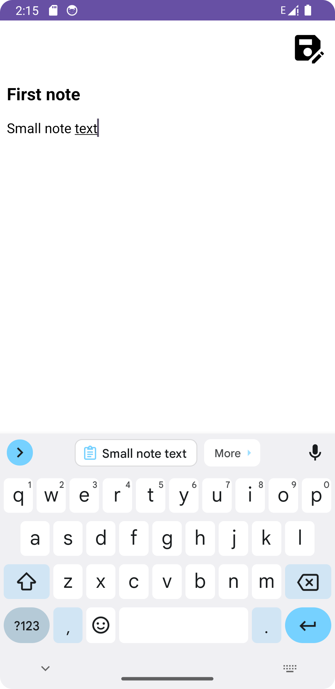
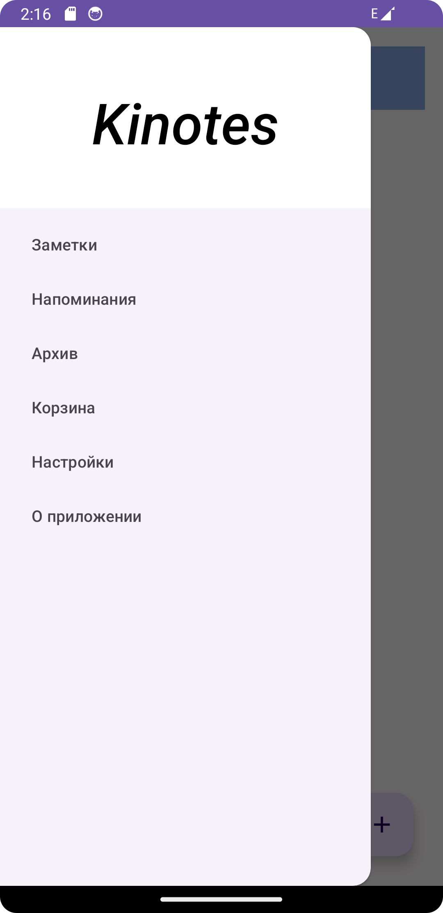

# 📝 KiNotes — приложение для заметок

> Минималистичное Android-приложение для быстрых и удобных заметок.  
> Создано на **Java** с использованием Android SDK и современных подходов.

---

## ✨ Основные возможности
✅ Создание и редактирование заметок  
✅ Удобный список с поддержкой прокрутки  
✅ Удаление заметок в один клик  
✅ Локальное хранение данных  
✅ Адаптивный интерфейс (светлая / тёмная тема)  

---

## 🛠 Технологический стек
- **Java 8+**
- **Android SDK**
- **ViewBinding**
- **RecyclerView**
- **Material Components**

---

## 🚀 Установка и запуск
1. Клонируйте репозиторий:
   ```bash
   git clone https://github.com/Kinza945/KiNotes.git
2. Откройте проект в Android Studio
3. Запустите на эмуляторе или устройстве
      ```bash
      ./gradlew assembleDebug
      adb install app/build/outputs/apk/debug/app-debug.apk

---
📸 Скриншоты
## 📸 Скриншоты





💡 Чем полезен проект

Демонстрирует базовую архитектуру Android-приложения
Показывает работу с локальным хранением и пользовательским интерфейсом
Подходит как учебный кейс для начинающих Android-разработчиков

---

📬 Контакты

📧 egort.egort05@mail.ru

💬 Telegram: @share_tea085

